# OpenPIA infrastructure icons

30 schematic icons for identifying UK telecoms infrastructure in the field: footway and carriageway covers, chamber openings, poles and common endpoints. They are designed for **fast recognition in a mobile UI**, not as engineering drawings.

All artwork is **original schematic drawing**. It is based on published dimensions and recognition cues, and is not traced or copied from Openreach or manufacturer material.

## Files

One SVG per icon, shown below at 32 px high. File names are kebab-case versions of the type code (`pole-wood.svg` for `pole_wood`).

> On GitHub's dark theme the black linework is hard to see; the icons are drawn for light map and UI backgrounds.

### Footway / joint-box covers

| Icon | File | Type | Size (mm, L × W) | Recognition cues |
|:---:|---|---|---:|---|
|  | `jb21.svg` | JB21 | 410 × 310 | small rectangular cover, single central key point |
| 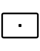 | `jb22.svg` | JB22 | 610 × 410 | larger small-box cover, single central key point |
| 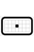 | `jb23.svg` | JB23 | 500 × 280 | rounded corners, grid texture |
| 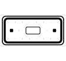 | `jb26.svg` | JB26 | 800 × 340 | thin surrounding edge, two side points, blank insert |
| 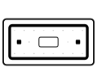 | `jf2.svg` | JF2 | 800 × 340 | wider fillet surround, two side points, blank insert |
| 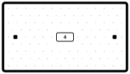 | `jf4.svg` | JF4 | 1000 × 550 | large single lid, type insert "4" |
|  | `jf5.svg` | JF5 | 700 × 700 | square, four edge points, type insert "5" |
| 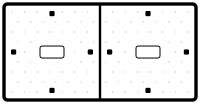 | `jf6.svg` | JF6 | 1400 × 700 | 2 lids |
| 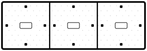 | `jf10.svg` | JF10 | 2400 × 800 | 3 broad lids |
| 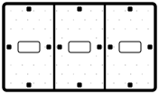 | `jf11.svg` | JF11 | 1400 × 800 | 3 narrower lids |

Sizes are approximate visible-cover dimensions.

### Carriageway covers

| Icon | File | Type | Size (mm) | Lids |
|:---:|---|---|---:|---|
| 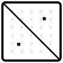 | `cw1.svg` | CW1 | 610 × 610 × 150 | 2 triangular |
| 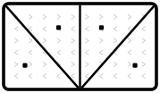 | `cw2.svg` | CW2 | 1220 × 685 × 150 | 4 triangular |
| 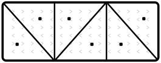 | `cw3.svg` | CW3 | 1830 × 685 × 150 | 6 triangular |
| 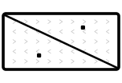 | `cw4.svg` | CW4 | 915 × 445 × 150 | 2 elongated triangular |

Sizes are frame and cover technical dimensions.

### Chamber / opening symbols

These show the chamber opening footprint, not the surface cover.

| Icon | File | Type | Opening (mm) |
|:---:|---|---|---:|
| 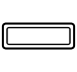 | `jbf102.svg` | JBF102 | 725 × 255 (Type 102 / No.2 reference basis) |
| 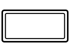 | `jbf104.svg` | JBF104 **and JMF104** | 915 × 445 |
| 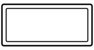 | `jbf106.svg` | JBF106 **and JMF106** | 1310 × 610 |
| 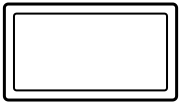 | `jbc2.svg` | JBC2(N) | 1220 × 680 |
| 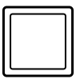 | `jbc3.svg` | JBC3(N) | 610 × 610 |
|  | `jbc4.svg` | JBC4(N) | 915 × 445 |

JMF104 and JMF106 share their JBF counterparts' opening geometry, so there are no separate files. Map `jmf104` to `jbf104.svg` and `jmf106` to `jbf106.svg`.

### Poles

| Icon | File | Type |
|:---:|---|---|
|  | `pole-wood.svg` | Wood pole |
|  | `pole-steel.svg` | Hollow metal (steel) pole |
|  | `pole-fibreglass.svg` | Fibreglass pole |
|  | `pole-joint-user.svg` | Joint user pole (shared with power) |
|  | `pole-unknown.svg` | Pole, type unknown |

### Endpoints / other assets

| Icon | File | Type |
|:---:|---|---|
| 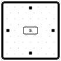 | `manhole.svg` | Manhole / chamber (generic, uses the JF5 cover visual) |
| 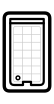 | `toby.svg` | Toby box (top-down cover) |
| 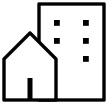 | `building.svg` | Premises / building |
| 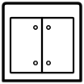 | `cabinet.svg` | Street cabinet (generic front view) |
| 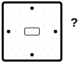 | `cover-unknown.svg` | Unknown / non-standard cover |

## Looking up an icon from data

[`icons.json`](icons.json) maps codes to files, so an app never has to derive a file name:

- **`types`** has an entry for every infrastructure type in [`schema/v0.1/common/infrastructure-map.json`](../../schema/v0.1/common/infrastructure-map.json), e.g. `"pole_wood": "pole-wood.svg"`, `"chamber_non_standard": "cover-unknown.svg"`.
- **`extras`** covers codes that are not (yet) schema types: `jbf102`, `cw4`, the `jmf104`/`jmf106` aliases, and the generic endpoints (`manhole`, `toby`, `cabinet`, `pole_unknown`, `cover_unknown`).

CI (`tools/check_icons.py`) fails if a schema type has no icon, a referenced file is missing, or an SVG is not 104 units high.

## Using the icons

- **Display every icon at the same height** (for example `height: 32px`) and let the width follow. Each file is 104 units high, so relative sizes are preserved.
  - Icons within a family (JF, carriageway, chambers) are drawn to a shared scale.
  - The small footway covers (JB21–JB26, JF2) share a smaller, true-proportion scale.
- Each file has a `viewBox="0 0 W 104"`, with 4 units of padding around the shape and no fixed `width` or `height`.
- **Colours:** black (`#000`) linework and white (`#fff`) interiors on a transparent background. The white interiors are intentional: covers read as solid lids when drawn over a map. Texture marks are black at 22% opacity.
- Files contain only filled paths: no strokes, no text, no `id`s. Several can be inlined on one page without clashes.

## Source

The SVGs are generated from master artwork maintained by the project maintainers, so please don't edit them by hand. To propose a new icon or a change to one, email [feedback@openpia.org](mailto:feedback@openpia.org) with a sketch or photo.

Dimensions are taken from public Openreach documents:

- [Identifying our equipment](https://www.openreach.com/content/dam/openreach/openreach-dam-files/images/help-and-support/identifying_our_equipment_guide.pdf) — approximate visible-cover sizes, pole materials
- [LN320 Issue 26](https://www.openreach.com/content/dam/openreach/openreach-dam-files/new-dam-(not-in-use-yet)/documents/product/developers/LN320%20-%20Issue%2026%20Website.pdf) — footway and carriageway frame and cover tables
- [New Sites Joint Box Frames Covers Quick Guide (Aug 2024)](https://www.openreach.com/content/dam/openreach/openreach-dam-files/new-dam-(not-in-use-yet)/documents/help-support/New-Sites-Joint-Box-Frames-Covers-Quick-Guide-August-2024-online.pdf) — JBF104 and JBF106
- [Quick guide: joint boxes, footways, frames and covers (Jun 2022)](https://www.openreach.com/content/dam/openreach/openreach-dam-files/documents/Quick%20guide%20Joint%20boxes%20footways%20frames%20and%20covers%20June%202022%20online.pdf) — JBC openings

Openreach names and type codes are used only to identify the equipment each icon represents.

## Licence

The icon artwork is licensed under [CC BY 4.0](https://creativecommons.org/licenses/by/4.0/), in line with the OpenPIA specification and documentation.
